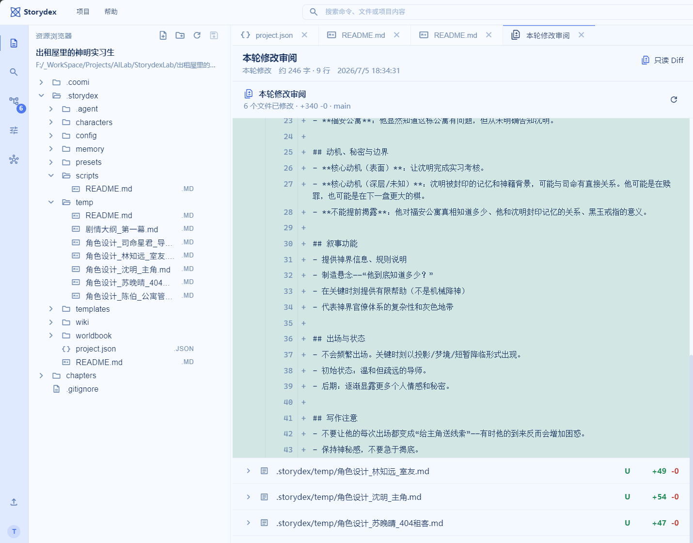
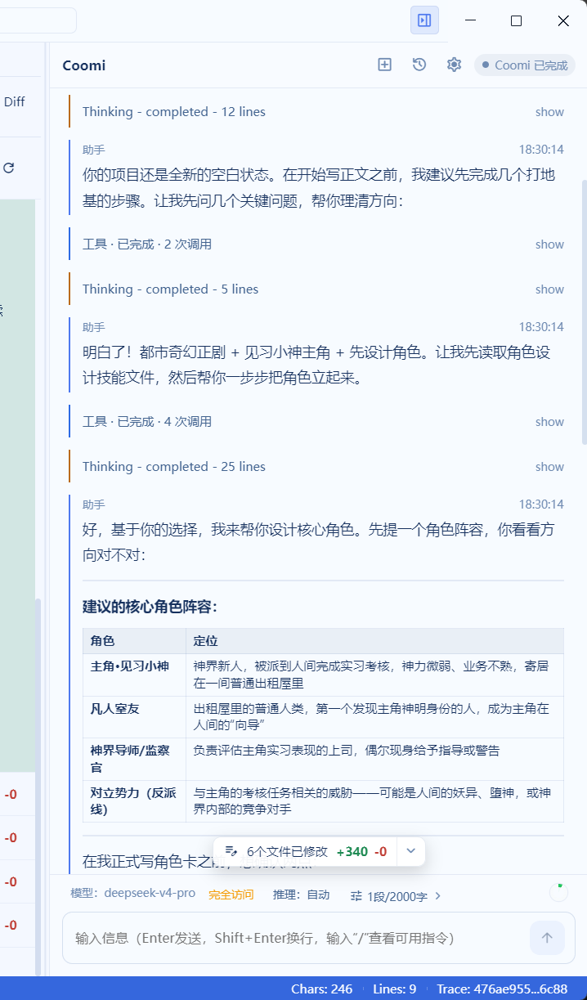

# Storydex

<table align="center">
  <tr>
    <td align="center" width="33%">
      
      <br />
      <sub><strong>Storydex</strong><br />项目 LOGO</sub>
    </td>
    <td align="center" width="33%">
      
      <br />
      <sub><strong>Coomi</strong><br />Agent 吉祥物</sub>
    </td>
    <td align="center" width="33%">
      
      <br />
      <sub><strong>TensorHub</strong><br />组织 LOGO</sub>
    </td>
  </tr>
</table>

<p align="center">
  
  
  
  
  
  
  
  
  
  
</p>

Storydex 是一个面向长篇小说创作的本地优先写作工作台。它把正文编辑、项目文件管理、Coomi Agent、版本控制、预设管理、知识图谱和使用指南放在同一个桌面应用里，让 AI 参与创作时保持可观察、可审阅、可回滚。

<p align="center">
  <a href="docs/assets/readme/storydex-workbench-review.png">点击查看 2098 × 1223 完整分辨率工作台截图</a>
</p>

<p align="center">
  <a href="docs/assets/readme/storydex-workbench-review.png">
    
  </a>
</p>

<p align="center">
  <a href="docs/assets/readme/storydex-workbench-review.png">
    
  </a>
</p>

## 核心能力

- **小说项目工作台**：统一管理章节、设定、角色、WIKI、世界观和项目资源。
- **Coomi Agent**：理解你本轮的创作意图，围绕当前 Storydex 项目读取上下文，进行续写、整理、审阅、生成和工具调用。
- **检索与记忆**：面向中文优化的项目全文检索、滚动章节摘要、相关旧文召回和 WIKI 参考注入，让 Agent 在长篇续写中先查证再落笔。
- **版本控制**：内置 Git / MinGit 工作流，支持本轮修改审阅、Diff 查看和历史回看。
- **创作预设**：维护写作约束、风格规则、导入规则和默认章节目录。
- **知识图谱与 WIKI**：把角色、事件、关系、地点和设定组织成可检索的结构化资料。
- **桌面体验**：提供多主题界面、资源浏览器、编辑区、Agent 面板和项目级使用指南，支持应用内差分更新。

## 快速开始

```powershell
npm --prefix apps/frontend install
npm --prefix apps/desktop install
pip install -r requirements.txt
```

复制 `.env.sample` 为 `.env`，按需填写模型服务配置，然后启动：

```powershell
.\start-storydex.bat
```

也可以分别启动桌面端或完整开发环境：

```powershell
.\start-desktop.bat
.\scripts\run_fullstack_dev.bat
```

## 项目结构

```text
Storydex/
├─ apps/frontend/        # Vue 工作台
├─ apps/backend/         # FastAPI 后端服务
├─ apps/desktop/         # Electron 桌面壳
├─ assets/               # 项目 LOGO、吉祥物与组织 LOGO
├─ docs/使用指南/         # 内置使用指南
├─ docs/assets/readme/   # README 展示图
├─ scripts/              # 开发与启动脚本
└─ start-storydex.bat    # 一键启动入口
```

## 文档

- [使用指南](docs/使用指南/README.md)
- [项目架构说明](docs/项目架构说明.md)

## 许可证

本项目采用 Apache License 2.0 + Commons Clause 许可证组合。源码可用于个人学习、研究和教学等非商业用途；商业使用、SaaS 托管、付费服务、二次分发或对外提供衍生版本前，需要获得单独书面授权。

商业授权请联系：septemc@foxmail.com。详细条款请阅读 [LICENSE](LICENSE) 与 [COMMERCIAL-LICENSE.md](COMMERCIAL-LICENSE.md)。

## 作者与版权

Copyright 2026 Septemc and Flowby.

## v0.3.7

v0.3.7 修复了部分 Windows 环境中 Agent 调用 LLM 时持续出现 `APIConnectionError: Connection error` 的问题。根因是构建脚本优先复制任意 Conda Python 3.9 环境，迁移后可能保留不匹配的 OpenSSL DLL，导致特定 HTTPS Provider 在握手阶段触发 `SSLEOFError`。

项目 Python 构建现在优先选择明确配置的运行时、官方 `py -3.9` 或系统 Python 3.9，仅在没有可用标准运行时时回退到 Conda。正式包继续固定并验证 `coomi-agent==1.1.2`，同时保留内嵌 Python 和 MinGit。

## v0.3.6

v0.3.6 是补丁级稳定性更新，进一步加强 AI 运行链路的一致性保障、启动依赖异常识别和运行环境兼容性检查。

## v0.3.5

v0.3.5 改进了大文件、长期记忆、文件诊断和桌面差分安装体验。小文件继续完整编辑，2～20MB 文件采用渐进读取，大于 20MB 默认使用只读快速预览；首屏按约 256KB 分块读取，滚动时按需跳转并取消过期请求，避免大文件阻塞界面。

`.storydex/memory` 现在只保存变量、事实、人物状态、关系、时间线等长期记忆，历史会话仍位于 `.storydex/.agent/sessions`。memory 使用带模块目录、稳定 ID、schemaVersion、revision、变更账本和恢复点的受约束自适应布局；`.storydex/temp` 只是用户可见的普通临时工作台，不参与索引、诊断、自动清理或常规上下文注入。每个新项目都会在 memory README 中写入完整治理规范。

资源浏览器增加统一问题面板和分级诊断：错误、警告、迁移提示与 Git 修改状态互相独立，UTF-8 BOM 可兼容读取并一键移除。Coomi 运行环境严格固定为 `coomi-agent==1.1.2`，开发、CI 和内嵌 Python 均验证实际安装版本。

差分安装改由独立辅助窗口接管，持续显示等待退出、安装、成功或失败状态。安装锁会阻止半更新状态的主程序启动；完成后由用户选择立即启动或稍后启动，失败时保留旧版本及安装日志。

## v0.3.4

v0.3.4 是桌面差分更新热修复版。它取消了 NSIS 替换应用文件期间强制立即拉起新进程的行为，避免更新后的首次启动因 `electron-updater/out/main.js` 尚未就位而出现 JavaScript 主进程错误。

自动更新组件现在会对安装切换窗口中的临时加载失败执行确定性重试，恢复后自动回到可检查更新状态；设置页不再重复显示同一条“不支持更新”错误。桌面打包校验会强制检查 `electron-updater` 入口文件，Electron E2E 也会模拟入口文件短暂缺失并验证自动恢复。

## v0.3.3

v0.3.3 修复了离线 Material Symbols 图标在冷启动或字体加载失败时显示为空白的问题，并为字体加载增加确定性重试、超时状态和可见文本降级。Coomi 现在会在请求进入后立即发送 `RunAccepted`，随后持续发送带耗时的 `TurnPhase` 和 heartbeat，因此意图识别、上下文装配或模型等待期间不会长期停留在没有过程反馈的“执行中”。

Coomi/OpenAI provider 的首次导入和客户端初始化已从 SSE 请求事件循环中隔离，冷启动时也不会阻塞阶段计时。打包态自动化实测首个 SSE 通常在 10ms 内到达，heartbeat 按约 600ms 周期继续刷新。

会话恢复改为 Storydex 项目、Storydex sessionId 与 Coomi JSONL 历史的隔离映射。重新启动应用后，原会话可继续读取上一轮用户、助手、工具与待执行动作；“执行”等省略指令会承接上一轮确认语义，不会仅因活动文件位于 `chapters/` 而误触发新剧情生成。

同时修复了 AgentPanel 启动阶段的历史读取竞态：较晚返回的旧历史请求不会再覆盖正在运行的新会话，也不会导致末尾 Git 提交提示丢失。

本地 Git 确认面板会在点击自动提交、手动提交或跳过后立即收起并显示操作状态。跳过不再重新扫描完整仓库，提交说明生成有 2 秒超时和本地确定性回退。该功能只在小说项目中创建本地 Git 版本，**不会自动配置远程仓库，也不会自动 push**。

## 开发与测试

安装测试依赖后，可使用统一 PowerShell 入口：

```powershell
pip install -r apps/backend/requirements-test.txt
npm ci --prefix apps/frontend
npm ci --prefix apps/desktop
.\scripts\run_full_test_suite.ps1 -Mode Fast
.\scripts\run_full_test_suite.ps1 -Mode Full
.\scripts\run_full_test_suite.ps1 -Mode Release
```

- `Fast`：编码、冲突标记、版本、Python 编译、后端 pytest/覆盖率、前端类型/Vitest/回归/构建、桌面单元与发布配置检查。
- `Full`：在 Fast 基础上构建 `win-unpacked`，验证前端字体、后端、嵌入式 Python、MinGit 与更新配置，并运行隔离用户目录的 Electron E2E。
- `Release`：在 Full 基础上生成并验证 NSIS installer、blockmap、`latest.yml` 和校验文件；任何阶段失败都会返回非零退出码。

测试代码分别位于 `apps/backend/tests`、`apps/frontend/tests` 和 `apps/desktop/tests`。后端覆盖 unit、API contract、integration、security、SSE 性能、会话恢复和并发失败恢复；前端覆盖 SSE parser、Pinia store、AgentPanel 与字体状态机；桌面覆盖 Node 契约、打包资源、Electron 冷启动和更新元数据。所有自动化测试使用临时 HOME、临时项目和 fake/mock provider，不访问真实付费 LLM 或用户配置。

`.github/workflows/ci.yml` 在 PR、main push 和手动触发时调用可复用的 `quality-gate.yml`。质量门禁覆盖 Python 3.9（Windows/Ubuntu）、Python 3.13 Windows 兼容性、Node 20、Windows 打包与 Electron E2E，并上传 JUnit、覆盖率和失败诊断产物。发布工作流必须先通过同一质量门禁。

## Windows 安装、便携包与应用内更新

v0.3.7 发布资产包括 NSIS 安装包、`Storydex-win-unpacked.zip` 便携包、blockmap、`latest.yml`、SHA256 校验、发布说明、依赖清单和构建 manifest。安装包与便携包均内置可迁移的 Python 3.9 运行环境、后端依赖、固定版本的 `coomi-agent==1.1.2` 和 MinGit，用户无需另外安装 Python 或 Git 即可启动后端并使用小说项目本地版本管理。

发布构建会执行嵌入式 Python import/preflight、MinGit 文件检查和完整打包资源扫描；测试目录、coverage 文件、pytest 缓存、日志、`.env` 和其他开发期临时文件不会进入正式包。应用内更新使用 `electron-updater` 的 generic feed；安装版可使用 blockmap 进行差分下载，便携包适合解压后直接启动和人工验证。

## Desktop Update Feed

Windows desktop releases use the generic electron-updater feed at:

```text
https://updates.septemc.com/storydex/windows/
```

For differential-update testing, keep the `0.3.6` installer and blockmap available, publish the `0.3.7` assets, and leave `latest.yml` pointing to `0.3.7`. Install v0.3.6 first, then check for updates inside Storydex to verify the `0.3.6 -> 0.3.7` assisted-install and recovery path.
