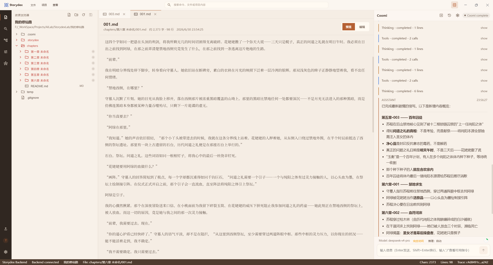

# Storydex

Storydex 是一个面向长篇小说创作的本地优先写作工作台。它将正文编辑、项目文件管理、Coomi Agent、版本控制、预设管理、知识图谱和主题配置放在同一个桌面应用中，目标是让 AI 以可观察、可回滚、可审阅的方式参与小说工程化创作。



## 核心能力

- 写作工作台：三栏式桌面工作台，包含资源导航、Markdown 编辑器和 Coomi Agent 面板。
- Coomi Agent：支持围绕项目文件、角色、设定、记忆和上下文进行续写、整理、检索与生成。
- 版本控制：为小说项目保存快照，便于回看、对比和回滚创作历史。
- 预设管理：维护写作约束、风格规则、导入规则和项目配置。
- 知识图谱 / LLM WIKI：将章节、角色、事件、伏笔和时间线组织成结构化知识库。
- 桌面体验：提供浅色、深色和蓝色主题，并支持本地开发与桌面打包。

## 技术栈

- 前端：Vue 3、TypeScript、Pinia、Vite、Axios
- 桌面端：Electron
- 后端：Python、FastAPI、Pydantic、Uvicorn、python-dotenv
- 工程：npm、PowerShell / Batch 启动脚本、本地文件工作区

## 项目结构

```text
Storydex/
├─ apps/
│  ├─ frontend/          # Vue 前端工作台
│  ├─ backend/           # FastAPI 后端服务
│  └─ desktop/           # Electron 桌面应用
├─ assets/               # 应用图标与展示资源
├─ docs/
│  ├─ 使用指南/           # 用户使用指南，开源保留
│  ├─ assets/readme/     # README 展示图片
│  └─ 项目架构说明.md
├─ scripts/              # 启动与构建脚本
├─ start-storydex.bat    # 一键启动脚本
├─ start-desktop.bat     # 桌面端启动脚本
├─ README.md
├─ LICENSE
├─ COMMERCIAL-LICENSE.md
└─ requirements.txt
```

## 快速开始

### 1. 安装依赖

```powershell
npm --prefix apps/frontend install
npm --prefix apps/desktop install
pip install -r requirements.txt
```

### 2. 配置环境变量

复制 `.env.sample` 为 `.env`，并按需填写模型服务配置。

```env
ANTHROPIC_BASE_URL=https://example.com/anthropic
ANTHROPIC_API_KEY=your_api_key
LLM_MODEL=your_model
```

`.env`、`.env.*`、本地密钥、证书、日志、缓存和构建产物均应保持在本地，不应提交到远程仓库。

### 3. 启动开发环境

```powershell
.\start-storydex.bat
```

也可以分别使用：

```powershell
.\scripts\run_desktop_dev.bat
.\scripts\run_fullstack_dev.bat
```

## 文档

- [使用指南](docs/使用指南/README.md)
- [项目架构说明](docs/项目架构说明.md)

## 许可证

本项目采用 Apache License 2.0 + Commons Clause 许可证组合。源码可用于非商业目的，包括个人学习、研究和教学，这些非商业用途不受额外限制。

未经权利人单独书面授权，不得将本项目或其衍生版本用于商业使用，包括但不限于销售、SaaS 托管、向第三方提供商业服务、付费托管、付费咨询、付费支持，或以本软件功能作为主要价值来源提供商业产品或服务。二次开发后发布、分发或提供给第三方使用，也需单独获得授权。

商业授权请发送邮件至：septemc@foxmail.com。邮件中请说明主体信息、使用场景、部署方式、是否对外提供服务、预计用户规模和需要授权的范围。

详细条款请阅读 [LICENSE](LICENSE) 与 [COMMERCIAL-LICENSE.md](COMMERCIAL-LICENSE.md)。许可证条款的适用性可能因司法辖区、分发方式和业务模式而不同，正式商用或公开分发前请自行核实条款适用性，必要时咨询专业律师。

## 作者与版权

Copyright 2026 Septemc and Flowby.
