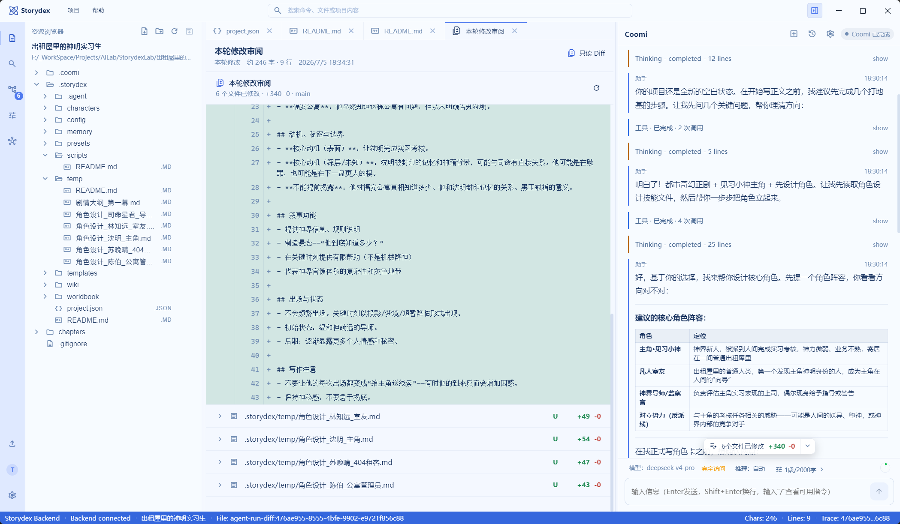

# Storydex

<table align="center">
  <tr>
    <td align="center" width="33%">
      
      <br />
      <sub><strong>Storydex</strong><br />项目 LOGO</sub>
    </td>
    <td align="center" width="33%">
      
      <br />
      <sub><strong>Coomi</strong><br />Agent 吉祥物</sub>
    </td>
    <td align="center" width="33%">
      
      <br />
      <sub><strong>TensorHub</strong><br />组织 LOGO</sub>
    </td>
  </tr>
</table>

<p align="center">
  
  
  
  
  
  
  
  
  
  
</p>

Storydex 是一个面向长篇小说创作的本地优先写作工作台。它把正文编辑、项目文件管理、Coomi Agent、版本控制、预设管理、知识图谱和使用指南放在同一个桌面应用里，让 AI 参与创作时保持可观察、可审阅、可回滚。

<p align="center">
  
</p>

## 核心能力

- **小说项目工作台**：统一管理章节、设定、角色、WIKI、世界观和项目资源。
- **Coomi Agent**：围绕当前 Storydex 项目读取上下文，进行续写、整理、审阅、生成和工具调用。
- **版本控制**：内置 Git / MinGit 工作流，支持本轮修改审阅、Diff 查看和历史回看。
- **创作预设**：维护写作约束、风格规则、导入规则和默认章节目录。
- **知识图谱与 WIKI**：把角色、事件、关系、地点和设定组织成可检索的结构化资料。
- **桌面体验**：提供多主题界面、资源浏览器、编辑区、Agent 面板和项目级使用指南。

## 快速开始

```powershell
npm --prefix apps/frontend install
npm --prefix apps/desktop install
pip install -r requirements.txt
```

复制 `.env.sample` 为 `.env`，按需填写模型服务配置，然后启动：

```powershell
.\start-storydex.bat
```

也可以分别启动桌面端或完整开发环境：

```powershell
.\start-desktop.bat
.\scripts\run_fullstack_dev.bat
```

## 项目结构

```text
Storydex/
├─ apps/frontend/        # Vue 工作台
├─ apps/backend/         # FastAPI 后端服务
├─ apps/desktop/         # Electron 桌面壳
├─ assets/               # 项目 LOGO、吉祥物与组织 LOGO
├─ docs/使用指南/         # 内置使用指南
├─ docs/assets/readme/   # README 展示图
├─ scripts/              # 开发与启动脚本
└─ start-storydex.bat    # 一键启动入口
```

## 文档

- [使用指南](docs/使用指南/README.md)
- [项目架构说明](docs/项目架构说明.md)

## 许可证

本项目采用 Apache License 2.0 + Commons Clause 许可证组合。源码可用于个人学习、研究和教学等非商业用途；商业使用、SaaS 托管、付费服务、二次分发或对外提供衍生版本前，需要获得单独书面授权。

商业授权请联系：septemc@foxmail.com。详细条款请阅读 [LICENSE](LICENSE) 与 [COMMERCIAL-LICENSE.md](COMMERCIAL-LICENSE.md)。

## 作者与版权

Copyright 2026 Septemc and Flowby.
