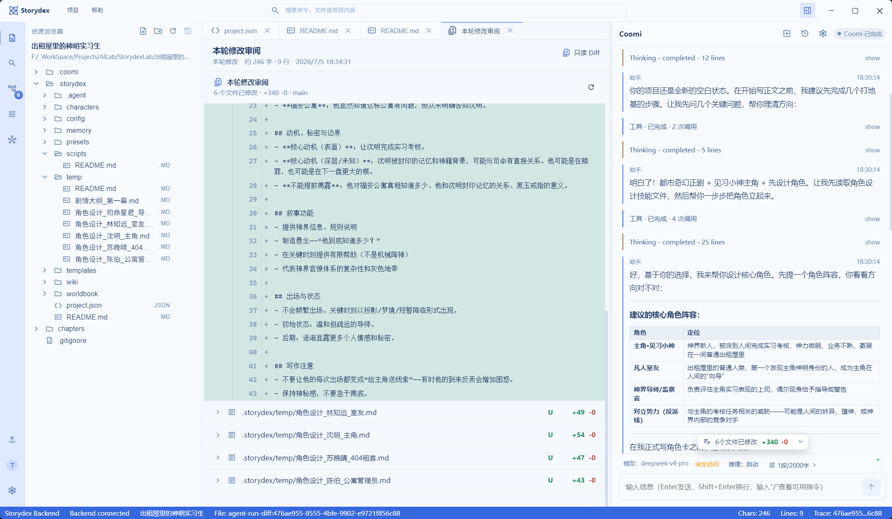

# Storydex

<p align="center">
  
</p>

<p align="center">
  <strong>本地优先的 AI 长篇小说创作工作台</strong><br />
  把正文、设定、Agent、检索、WIKI 和版本记录放在一个可审阅、可回滚的工作区。
</p>

<p align="center">
  <a href="https://github.com/TensorHub-ORG/Storydex/actions/workflows/ci.yml?query=branch%3Amain"></a>
  <a href="https://github.com/TensorHub-ORG/Storydex/releases"></a>
  <a href="LICENSE"></a>
  <a href="https://github.com/TensorHub-ORG/Storydex/stargazers"></a>
  
  
  
  
</p>

<p align="center">
  <a href="https://storydex.septemc.com/">官网</a> ·
  <a href="https://github.com/TensorHub-ORG/Storydex/releases">下载</a> ·
  <a href="docs/guide/README.md">使用文档</a> ·
  <a href="https://github.com/TensorHub-ORG/Storydex/issues">问题反馈</a>
</p>

<p align="center">
  <a href="docs/assets/readme/storydex-workbench-review-full.png">
    
  </a>
</p>

## 简介

Storydex 面向需要长期维护世界观、角色关系和章节连续性的小说作者。它以本地文件为事实源，把写作、资料整理、Agent 协作和版本控制放进同一个桌面工作台：你可以先查证项目资料，再让 Agent 生成或修改内容，并在提交前审阅 Diff。

Windows 当前源码主线的唯一桌面链路是 `Vue → Tauri 2 → storydex-agentd → Coomi Rust`。Python/FastAPI 仅保留非 Stable 的后端兼容与测试边界，不提供 Agent 产品入口；Electron 桌面运行时和旧打包入口已移除。已发布版本的具体资产格式以对应的 [GitHub Release](https://github.com/TensorHub-ORG/Storydex/releases) 为准，README 不复制逐版本历史说明。

## 核心能力

- **小说项目工作台**：统一管理章节、角色、世界观、WIKI、预设和项目资源。
- **Coomi Agent**：围绕当前项目证据进行续写、整理、审阅、设定生成和工具调用。
- **长篇检索与记忆**：全文搜索、章节摘要、相关旧文召回和 WIKI 参考注入，帮助 Agent 先查证再落笔。
- **可审阅的修改流程**：展示运行阶段、工具结果和 Diff；写入操作受项目目录边界约束。
- **本地版本控制**：使用 Git/MinGit 记录小说项目变化，支持提交、Diff、历史回看和回退。
- **可复用创作资产**：内置指令仓库、技能模板和项目级预设，可按自己的写作流程扩展。

## 下载与运行

### 普通用户

从 [GitHub Releases](https://github.com/TensorHub-ORG/Storydex/releases) 下载与你的平台和版本匹配的发行资产。公开 Release 可能与当前源码主线处于不同发布阶段：已发布版本按 Release 页面说明使用，当前 Tauri 源码按下方开发步骤验证。安装包、便携包、校验文件和发行说明以 Release 页面为准；不要从源码仓库的 `target`、`release` 或测试目录直接运行发行文件。

首次启动后，在 Storydex 的系统设置中配置模型服务。API Key 等敏感配置只应保存在本机受保护的位置，不要提交到 Git 仓库或反馈材料中。

### Windows 源码开发

需要：Windows 10/11、Node.js 20、Rust 工具链（仓库使用 Rust 1.95）、Windows WebView2 和可用的 Cargo/npm 网络环境。

```powershell
npm ci --prefix apps/frontend
npm ci --prefix apps/desktop
cargo build --manifest-path apps/desktop/agent-runtime/Cargo.toml --locked -p storydex-agentd
npm --prefix apps/desktop run dev
```

桌面端的默认 `dev`、构建、打包和 Tauri 检查入口位于 `apps/desktop/package.json`。普通 Windows Stable 开发不需要安装 Python；默认入口直接启动 Rust/Tauri：

```powershell
.\scripts\run_desktop_dev.bat
```

## 文档

### 面向用户

- [使用说明索引](docs/guide/README.md)：安装后操作、项目结构、LLM 配置、预设、WIKI、版本控制和系统设置。
- [指令仓库模板](docs/prompts/README.md)：可直接在 Storydex 中使用的通用创作指令。
- [内置技能模板](docs/skills/README.md)：初始化小说项目时使用的 Agent 技能输入。

### 面向贡献者与维护者

- [项目架构说明](docs/项目架构说明.md)：源码目录、运行链路和数据边界。
- [Agent 双平台 Rust 架构](docs/agent-runtime-architecture.md)：Windows 与 Android runtime 的职责边界。
- [Rust 接口覆盖清单](docs/rust-backend-interface-inventory.md)：前端真实 API 消费契约与 Rust 路由核对方式。
- [项目决策与评测结论](docs/项目决策与评测结论.md)：当前有效的架构决策和可复现实验结论。
- [封装与发布要求](docs/发行说明/Storydex-封装与发布要求.md)：版本、签名、发行资产、更新源和回滚门禁。
- [仓库自动化规则](AGENTS.md)：本地 hook、CI、提交和安全边界。

专项诊断、交接记录和一次性实验材料不属于公开产品文档，统一保存在被 `.gitignore` 忽略的 `local/archive/` 或外部存储中。

## 架构概览

```text
Vue 3 / TypeScript / Vite
          │
          ▼
Tauri 2 桌面壳
窗口、文件选择、预览、单实例、更新和进程生命周期
          │
          ▼
storydex-agentd（独立 Rust sidecar）
HTTP/SSE、Agent、项目文件、Git、WIKI、预设和系统接口
          │
          ▼
Coomi Rust runtime
Provider、会话、工具循环、权限、压缩与恢复
```

Tauri 只负责桌面能力和 sidecar 生命周期。`storydex-agentd` 使用动态 loopback 端口和运行令牌，前端不能直接获得任意 shell 或文件系统权限；小说项目读写在 Rust 服务侧执行路径归一化和工作区边界检查。

## 仓库结构

```text
Storydex/
├─ apps/frontend/                # Vue 小说创作工作台
├─ apps/desktop/                 # Tauri 2 Windows 桌面应用
│  ├─ agent-runtime/             # storydex-agentd 与 Coomi Rust runtime
│  └─ tauri-preview/             # 当前 Tauri Stable 源码（迁移期目录名）
├─ apps/backend/                 # 非 Stable 的 Python 后端兼容与测试边界
├─ apps/android/                 # Android 原生应用与独立 Rust runtime
├─ apps/android-frontend/        # Android WebView 前端
├─ assets/                       # LOGO、图标和展示资源
├─ docs/guide/                   # 用户使用说明
├─ docs/prompts/                 # 产品内置指令模板
├─ docs/skills/                  # 产品内置技能模板
├─ scripts/                      # 构建、检查和发布辅助脚本
├─ deploy/                       # 独立部署组件
├─ AGENTS.md                     # 仓库自动化与安全规则
└─ LICENSE / COMMERCIAL-LICENSE.md
```

## 分支与 CI

本仓库当前只在公开说明中定义两条主线：

- `dev/windows`：Windows 桌面端日常开发和聚焦验证，先通过 Development CI。
- `main`：稳定集成；普通改动按路径执行组件检查，同一 SHA 已通过 `dev/windows` 时复用 Windows 结果。

准备合入 `main` 的 Windows 改动应先在 `dev/windows` 验证，再以同一交付内容进入 `main`。其他远端分支和历史引用不在本次仓库治理范围内，本项目不会因本次文档整理删除或改写它们。

## 开发检查

根据改动范围运行聚焦检查。例如 Windows 桌面端：

```powershell
npm --prefix apps/frontend run test:unit
npm --prefix apps/desktop run test:unit
npm --prefix apps/desktop run check:release
npm --prefix apps/desktop run check:tauri
```

每次准备 push 前运行仓库规定的轻量检查：

```powershell
powershell -NoProfile -ExecutionPolicy Bypass -File scripts/run_pre_push_ci.ps1
```

这个入口只检查编码、冲突标记、版本一致性和 whitespace；组件测试由 GitHub Actions 按改动范围执行。打包资产检查通过 CI 手动输入 `packaged=true` 或 Windows 发布 dry-run 触发，Tauri GUI E2E 不作为 CI 门禁。需要完整本地验证时，人工运行 `scripts/run_full_test_suite.ps1 -Mode Fast|Full|Release`。

## 贡献与安全

欢迎通过 [Issues](https://github.com/TensorHub-ORG/Storydex/issues) 报告可复现问题，或提交围绕当前产品主线的 Pull Request。提交前请：

- 说明用户可感知的行为变化和验证命令；
- 不提交 API Key、私钥、证书、用户小说、日志、缓存、`node_modules`、Rust `target` 或打包产物；
- 修改运行时、发布配置或内置提示词时，同时更新对应的维护者文档和聚焦测试。

发现安全问题时，请不要在公开 Issue 中粘贴凭据或完整利用细节；请先通过 `septemc@foxmail.com` 私下联系维护者。

## 许可证

本项目采用 Apache License 2.0 与 Commons Clause 组合许可。个人学习、研究和教学等非商业用途可按许可证使用；商业使用、SaaS 托管、付费服务、二次分发或对外提供衍生版本前，请先取得书面授权。商业授权联系：`septemc@foxmail.com`。详见 [LICENSE](LICENSE) 和 [COMMERCIAL-LICENSE.md](COMMERCIAL-LICENSE.md)。

Copyright 2026 Septemc and Flowby.
